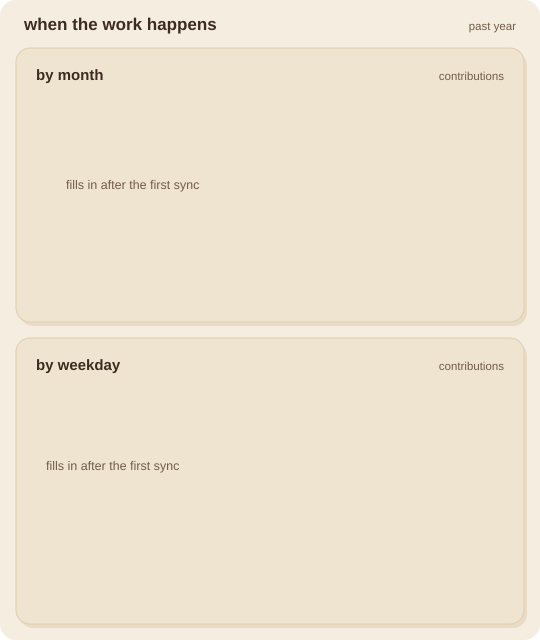
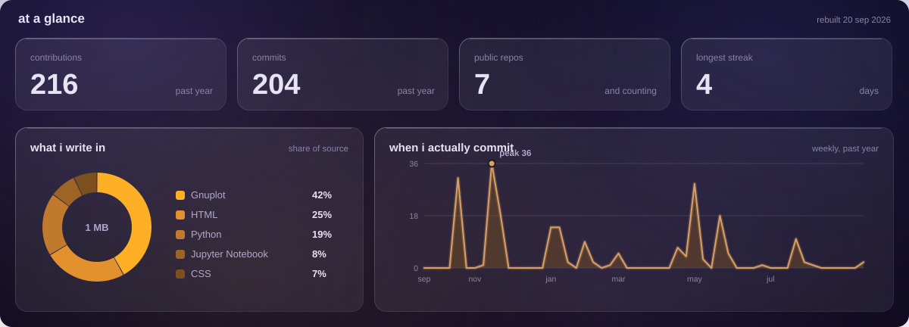

<h1>maximilien tragarz quintana</h1>

<p>
  
</p>

I love the intersection of computational physics, scientific computing (maybe SciML), and data-driven industries!
And love solving challenges and creating pipeline architectures, building autonomous systems is my specialty!

**Computational physics · quantitative research · scientific computing.**

I like problems where the math has to survive contact with real data. Long term I want to be doing research inside deep tech or R&D, somewhere computation is the product rather than the paperwork.

<br>

<sub><b>languages</b></sub>

<p>
  
  
  
  
  
  
</p>

<sub><b>scientific python</b></sub>

<p>
  
  
  
  
  
  
</p>

<sub><b>machine learning</b></sub>

<p>
  
  
  
</p>

<sub><b>physics & hpc</b></sub>

<p>
  
  
  
  
  
</p>

<sub><b>build & ship</b></sub>

<p>
  
  
  
  
  
</p>

<sub><b>hardware</b></sub>

<p>
  
  
  
</p>

<br>

<sub><b>how i build things</b></sub>

<table>
<tr>
<td width="34%">


</td>
<td width="66%">

Most of my projects end up shaped the same way: something measures or simulates the world, something else checks it hasn't drifted, and then a model decides what is worth computing next. I care much more about the second and third parts than people usually expect.

The rule I don't bend is that **nothing important lives only on my laptop**. If a figure can't be traced back to the exact run that made it, it isn't a result yet, it's a screenshot.

So every stage is idempotent, restartable, and containerised, inputs are content-addressed, and the whole thing is happy to be killed halfway through and resumed. That's the part I actually enjoy building.

What that buys me, in practice:

- a run that dies at 3am resumes instead of restarting
- swapping a pseudopotential doesn't invalidate the other 200 jobs
- the plot in the paper and the run that produced it are the same object
- the expensive part (DFT) only runs on the configurations the surrogate is actually unsure about

<sub>ingest &#183; check &#183; simulate &#183; reduce &#183; learn &#183; serve &#8212; and the loop back to the start</sub>

</td>
</tr>
</table>



<br>

<sub><b>the numbers</b></sub>

<table>
<tr>
<td width="60%">



</td>
<td width="40%">


</td>
</tr>
</table>







<p>
  
</p>

<sub>these redraw themselves every morning from the github api &#8212; see <a href=".github/workflows/dashboard.yml">the workflow</a>. not fetched from a stats service, because most of those are currently down.</sub>

<br>

<sub><b>coffee &#183; study &#183; hpc</b></sub>

<p align="center">
  
  
  
</p>

<sub>drawn pixel by pixel and animated in svg, so they play right here in the readme &#8212; <a href="scripts/gen_pixel_art.py">source</a>. the third one is my actual evening: a band structure on one screen, the queue on the other.</sub>

<br>

<sub><b>a few things i've made</b></sub>

**[QE-Workflow](https://github.com/BladedGoose13/QE-Workflow)** — electronic structure of silicon-doped graphene, DFT with Quantum ESPRESSO. Undergrad research at Tec de Monterrey with Dr. José Ángel Reyes Retana: first reproduce the known graphene band structure to prove the setup works, then go after Si doping through the Virtual Crystal Approximation. Ended up as a poster at the Tec Science Summit 2026.

**[ThermoHub.Sim](https://github.com/BladedGoose13/ThermoHub.Sim---V1.0)** — thermodynamic process simulation for industrial systems. Reads and interpolates steam tables (saturation by T and P, superheated, compressed) and wraps it in Streamlit so someone who doesn't code can actually use it.

**[LUMIO](https://github.com/BladedGoose13/ESG-Framework-LUMIO)** — quantitative ESG and impact-analytics framework, Monte Carlo plus optimisation, built for Consult for a Cause 2026 with Xignux and Strategy& (PwC).

**[PathWise](https://github.com/BladedGoose13/PathWise)** — an EdTech ecosystem, and the project where I learned most of what I know about shipping something other people have to use.

<details>
<summary><sub><b>the equation i stare at most</b></sub></summary>

<br>

Self-consistent Kohn–Sham. This is what Quantum ESPRESSO is grinding through on every SCF cycle, and why the coffee matters:

```math
\left[-\frac{\hbar^{2}}{2m}\nabla^{2} + v_{\text{eff}}[\rho](\mathbf{r})\right]\psi_{i}(\mathbf{r})
= \varepsilon_{i}\,\psi_{i}(\mathbf{r}),
\qquad
\rho(\mathbf{r}) = \sum_{i}^{N}\left|\psi_{i}(\mathbf{r})\right|^{2}
```

And doping a lattice without rebuilding a supercell for every concentration — the Virtual Crystal Approximation, which is just a weighted blend of pseudopotentials:

```math
V_{\text{VCA}}^{\,\text{ps}} = (1-x)\,V_{\text{C}}^{\,\text{ps}} + x\,V_{\text{Si}}^{\,\text{ps}}
```

</details>

<br>

The rest of me: indie and chill rock, gym (not ur average joe i promise!), anime, and plenty of videogames and crafts!
Coffee and bakery enjoyer! (and i believe connoisseur lol)
I also LOVE travelling and getting to know new people.

<p>
  
  
  
  
  
  
</p>

<br>

Talk to me about physics, an album you can't stop replaying, or the best café in a city you think I should visit.

<p>
  <a href="mailto:BladedGoose@gmail.com"></a>
  
</p>

<br>


