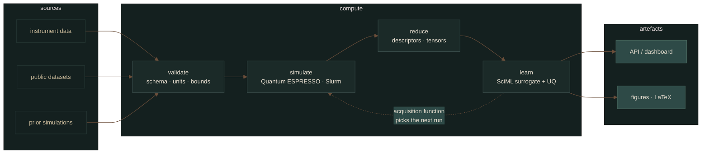

<!--
  Profile README for @BladedGoose13
  Generated assets live in assets/ and are rebuilt by .github/workflows/.
  Palette and layout notes: scripts/palette.py
-->

<div align="center">


<br><br>


<p>
  
  
  
  
</p>

</div>

---

## `01` · Thesis

> **I like problems where the math has to survive contact with real data.**

I work at the intersection of **computational physics**, **scientific computing / SciML**, and
**data-driven industries** — density functional theory on one side, pipelines and autonomous
systems on the other. The part I actually enjoy is the seam between them: taking something that
only exists as a derivation and making it run, repeatedly, on hardware, without me babysitting it.

Long term I want to be doing research inside deep tech or R&D — somewhere **computation is the
product rather than the paperwork**.

<br>

<div align="center">
  <table>
    <tr>
      <td align="center" width="25%"><sub><b>I OPTIMISE FOR</b></sub><br>reproducibility</td>
      <td align="center" width="25%"><sub><b>NO PATIENCE FOR</b></sub><br>results you can't rerun</td>
      <td align="center" width="25%"><sub><b>SPECIALTY</b></sub><br>autonomous pipelines</td>
      <td align="center" width="25%"><sub><b>CURRENTLY</b></sub><br>DFT · SciML surrogates</td>
    </tr>
  </table>
</div>

---

## `02` · Telemetry

<div align="center">


<br><br>


<br><br>


<sub>The dashboard above is generated from the GitHub GraphQL API and committed by
<a href=".github/workflows/dashboard.yml">a scheduled workflow</a> — not fetched from a
third-party card service, so it can't rate-limit, expire or 402.</sub>

</div>

---

## `03` · Architecture

Most of my work ends up looking like the same machine: data in, physics in the middle, a model
that decides what to compute next, and artefacts a human can actually read at the end.

<div align="center">


</div>

<details>
<summary><b>The same loop, as a graph</b></summary>

<br>



**Non-negotiables.** Every stage is idempotent and restartable. Inputs are content-addressed, so a
figure can always be traced back to the exact run that produced it. Nothing important happens on
my laptop — if it can't run in a container on a scheduler, it isn't finished.

</details>

---

## `04` · Instruments

<table>
<tr><td width="150"><sub><b>LANGUAGES</b></sub></td><td>
  
  
  
  
  
  
</td></tr>

<tr><td><sub><b>SCIENTIFIC PYTHON</b></sub></td><td>
  
  
  
  
  
  
</td></tr>

<tr><td><sub><b>MACHINE LEARNING</b></sub></td><td>
  
  
  
</td></tr>

<tr><td><sub><b>PHYSICS &amp; HPC</b></sub></td><td>
  
  
  
  
  
</td></tr>

<tr><td><sub><b>BUILD &amp; SHIP</b></sub></td><td>
  
  
  
  
  
</td></tr>

<tr><td><sub><b>HARDWARE</b></sub></td><td>
  
  
  
</td></tr>
</table>

---

## `05` · Selected work

<table>
<tr>
<td width="50%" valign="top">

### [QE-Workflow](https://github.com/BladedGoose13/QE-Workflow)
`Quantum ESPRESSO` `DFT` `Gnuplot`

Electronic structure of **silicon-doped graphene**. Undergraduate research training in
computational materials science at Tec de Monterrey, under Dr. José Ángel Reyes Retana.

Two stages: reproduce the known graphene band structure to validate the setup, then extend to an
original study of Si doping through the **Virtual Crystal Approximation**. Presented as a poster
at the **Tec Science Summit 2026** (NextGen Scientists Program).

</td>
<td width="50%" valign="top">

### [ThermoHub.Sim](https://github.com/BladedGoose13/ThermoHub.Sim---V1.0)
`Python` `Streamlit` `thermodynamics`

Simulation software for thermodynamic processes in industrial systems. Reads and **interpolates
steam tables** — saturation by *T* and *P*, superheated and compressed regions — and exposes the
whole thing through a Streamlit UI so a non-programmer can drive it.

</td>
</tr>
<tr>
<td width="50%" valign="top">

### [LUMIO — ESG Framework](https://github.com/BladedGoose13/ESG-Framework-LUMIO)
`Monte Carlo` `optimisation` `decision analysis`

Quantitative ESG and impact-analytics framework for evaluating, comparing and prioritising
initiatives. Built for **Consult for a Cause 2026** (Tec Consulting Club, with Xignux and
Strategy& — PwC Network).

</td>
<td width="50%" valign="top">

### [PathWise](https://github.com/BladedGoose13/PathWise)
`Python` `Docker` `LLM` `EdTech`

> *"The integrated EdTech ecosystem that converts scattered potential into structured success."*

An end-to-end platform rather than a script — and the project where I learned most of what I know
about shipping something other people have to use.

</td>
</tr>
</table>

<div align="center"><sub>
  Also around: <a href="https://github.com/BladedGoose13/STREAMLIT-Memorama">STREAMLIT-Memorama</a>
  — a pattern-recognition memory game, because not everything needs a Hamiltonian.
</sub></div>

---

## `06` · The math it rests on

The day job, compressed. Self-consistent Kohn–Sham, which is what Quantum ESPRESSO is actually
solving on every SCF cycle:

```math
\left[-\frac{\hbar^{2}}{2m}\nabla^{2} + v_{\text{eff}}[\rho](\mathbf{r})\right]\psi_{i}(\mathbf{r})
= \varepsilon_{i}\,\psi_{i}(\mathbf{r}),
\qquad
\rho(\mathbf{r}) = \sum_{i}^{N} \left|\psi_{i}(\mathbf{r})\right|^{2}
```

Doping a lattice without building a supercell for every concentration — the Virtual Crystal
Approximation, a weighted blend of pseudopotentials:

```math
V_{\text{VCA}}^{\,\text{ps}} = (1-x)\,V_{\text{C}}^{\,\text{ps}} + x\,V_{\text{Si}}^{\,\text{ps}}
```

And the part that makes it a pipeline instead of a pile of runs — a surrogate penalised for
disagreeing with the physics, not just with the data:

```math
\mathcal{L}(\theta) = \underbrace{\frac{1}{N}\sum_{n}\left\|u_{\theta}(t_{n}) - u_{n}\right\|^{2}}_{\text{data}}
\; + \; \lambda \underbrace{\left\|\frac{\mathrm{d}u_{\theta}}{\mathrm{d}t} - f(u_{\theta},t)\right\|^{2}}_{\text{residual}}
```

<sub>The banner at the top is not decoration either: it's a superposition of point vortices in a
uniform stream, <code>w(z) = U + Σ Γₖ/2πi(z − zₖ)</code>, integrated with RK4 at <code>h = 0.016</code>.
Those are real integral curves. Source: <a href="scripts/gen_hero.py">scripts/gen_hero.py</a>.</sub>

---

## `07` · Off duty

Indie and chill rock on repeat. The gym — **not your average joe, I promise**. Anime, a healthy
amount of videogames, and crafts when I need my hands busy instead of my head.

Coffee and bakery enjoyer, and I'd argue **connoisseur**. I also love travelling and meeting new
people, which is the fastest way I know to find out how little I know.

<p align="center">
  
  
  
  
  
  
</p>

---

<div align="center">

### Talk to me

about physics, an album you can't stop replaying, or the best café in a city you think I
should visit.

<p>
  <a href="mailto:BladedGoose@gmail.com"></a>
  <a href="https://github.com/BladedGoose13"></a>
</p>


</div>
