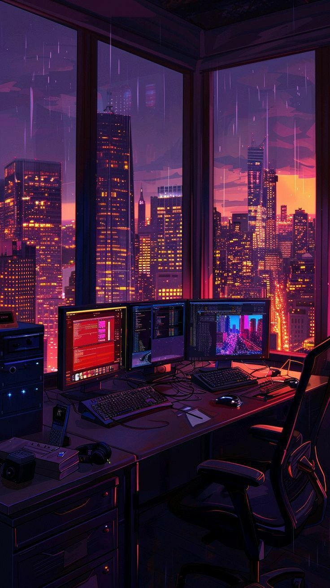
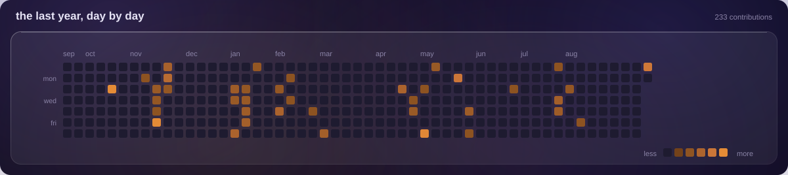
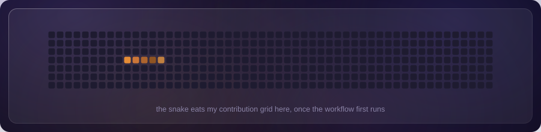
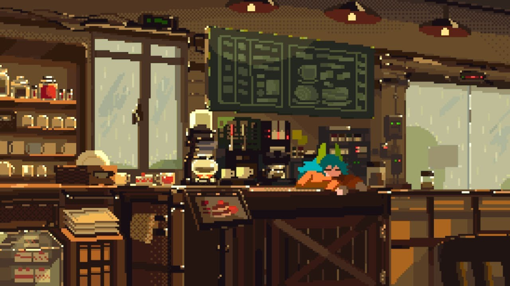

<table>
<tr>
<td width="34%">

</td>
<td width="66%">

<h1>What about me? Not much</h1>

I'm into computational physics and scientific computing, lately a lot of SciML. Pretty much anything with computing and data.

I like hard problems and building sharp architectures for autonomous systems that solve them. My main projects so far involve materials discovery using AI and Density Functional Theory in HPC for spintronics.

Long term I want to do research in deep tech or R&D, and get really good at HPC, machine learning and parallel computing for applied science.

</td>
</tr>
</table>

<b>my tools</b>

<table>
<tr><td width="14%"><b>core</b></td><td>  </td><td width="26%" rowspan="4" valign="top">

<!-- STATS:START -->

<!-- generated: live -->

<table>
<tr><td colspan="2"><b>past year</b></td></tr>
<tr><td>contributions</td><td align="right"><b>235</b></td></tr>
<tr><td>commits</td><td align="right"><b>218</b></td></tr>
<tr><td>public repos</td><td align="right"><b>7</b></td></tr>
<tr><td>longest streak</td><td align="right"><b>4</b> days</td></tr>
</table>

<!-- STATS:END -->

</td></tr>
<tr><td width="14%"><b>HPC &amp; SciML</b></td><td>    </td></tr>
<tr><td width="14%"><b>Physics</b></td><td>   </td></tr>
<tr><td width="14%"><b>ship</b></td><td>  </td></tr>
</table>

<!-- REPOS:END -->

<b>stuff i've built</b>

**[QE-Workflow](https://github.com/BladedGoose13/QE-Workflow)** &mdash; silicon-doped graphene band structures with Quantum ESPRESSO. reproduced the known graphene bands first to prove the setup wasn't lying to me, then went after Si doping with the Virtual Crystal Approximation. poster at Tec Science Summit 2026

**[ThermoHub.Sim](https://github.com/BladedGoose13/ThermoHub.Sim---V1.0)** &mdash; steam tables that actually interpolate, behind a Streamlit UI so you don't need to code to use it. enforces the state postulate too (two properties, no more!)

**[LUMIO](https://github.com/BladedGoose13/ESG-Framework-LUMIO)** &mdash; quantitative ESG framework, Monte Carlo + optimization under pretty imperfect data. built for Consult for a Cause 2026 with Xignux and Strategy&amp;

**[PathWise](https://github.com/BladedGoose13/PathWise)** &mdash; a PWA for high school students in Mexico. the one that taught me shipping is way harder than building

**[STREAMLIT-Memorama](https://github.com/BladedGoose13/STREAMLIT-Memorama)** &mdash; a memory and pattern recognition card game, not everything needs a Hamiltonian lol

The rest of me: indie and chill rock, gym (not ur average joe i promise!), anime, and plenty of videogames and crafts!
Coffee and bakery enjoyer! (and i believe connoisseur lol) I also LOVE travelling and getting to know new people.

     

Talk to me about physics, an album you can't stop replaying, or the best caf&eacute; in a city you think I should visit.

   

